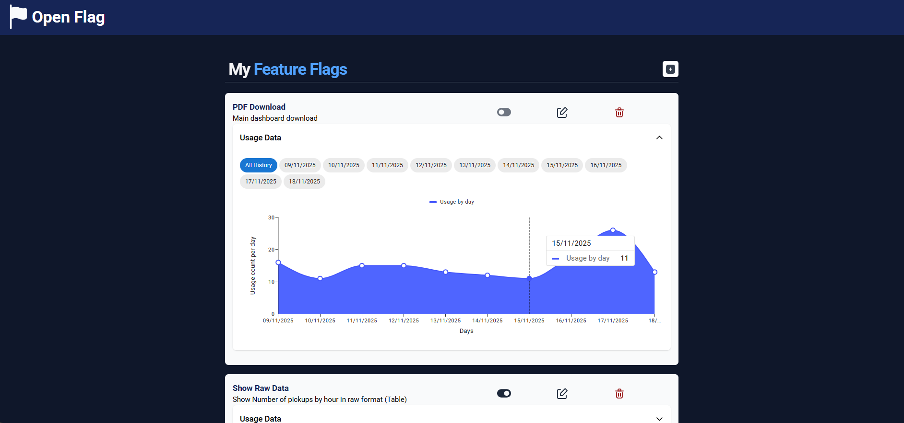

<!-- LOGO -->
 

  
  <h3 align="center"><strong>OpenFlag</strong></h3>
  

    Um gerenciador de *feature flags* aberto e minimalista!
     
    <a href="https://github.com/Ga-Alves/open-flag/issues">Report Bug</a>
    ·
    <a href="#Contato">Send Feedback</a>
  

<!-- DESCRIPTION -->
# Sobre o Projeto

**OpenFlag** é uma ferramenta simples, minimalista e aberta para a gerência de *feature flags* em projetos de software. O foco do projeto reside em simplicidade de uso, efetividade e extrema transparência, tanto aos gerentes, quanto aos usuários. OpenFlag permite, além do controle preciso das diversas funcionalidades de seu projeto, um acompanhamento de perto das estatísticas de uso de cada *feature flag*, com a geração automática de relatórios para a produção de *insights* relevantes e acionáveis. OpenFlag disponibiliza um servidor instanciável e interfaces de uso tanto via web, quanto via SDK a nível de código.

<!-- FUNCTIONALITIES -->
# Funcionalidades

A seguir, tem-se uma lista das principais *features* disponíveis na plataforma.

- Interface para criação de conta de usuário;
- Interface para acesso às *feature flags* associada a uma conta de usuário;
- Criação, remoção, atualização e verificação do status de *feature flags*;
- Gerência das *feature flags* via interface gráfica web e via SDK a nível de código;
- Rastreamento da utilização das *feature flags*;
- Geração de relatórios e análises com base nas informações de uso das *feature flags*;

<!-- USAGE -->
# Tecnologias

O servidor de gerência de *feature flags* foi implementado com a utilização da linguagem de programação Python e do framework <a href="https://fastapi.tiangolo.com/">FastAPI</a>. O banco de dados utilizado foi o <a href="https://sqlite.org/">SQLite3</a>. A interface web foi implementada com a utilização do framework <a href="https://vite.dev/">Vite</a>, em JavaScript. A SDK para controle a nível de código é disponibilizada como um pacote para a linguagem de programação Python.

<!-- USAGE -->
# Utilização

- Para instruções de instanciação do servidor de gerência, refira-se a <a href="https://github.com/Ga-Alves/open-flag/blob/master/packages/web-server/README.md">este link</a>;
- Para instruções de instanciação da interface web, refira-se a <a href="https://github.com/Ga-Alves/open-flag/tree/master/packages/web-client">este link</a>;
- Para instruções de instalação e uso do SDK, refira-se a <a href="https://github.com/Ga-Alves/open-flag/blob/master/packages/sdk/README.md">este link</a>;

<!-- CONTACT -->
# Contato

Bernardo Reis de Almeida

Bernardo Viggiano Campos

Davi Sakamoto Lamounier

Gabriel Alves Reis